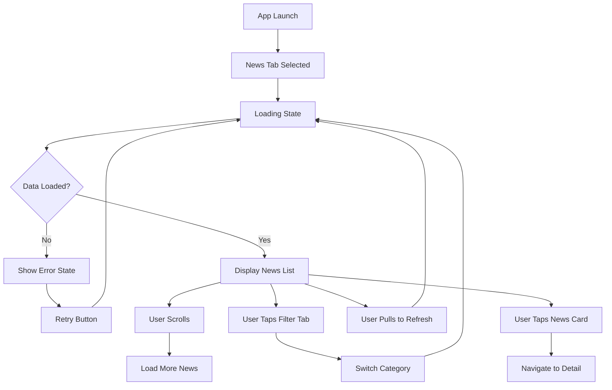
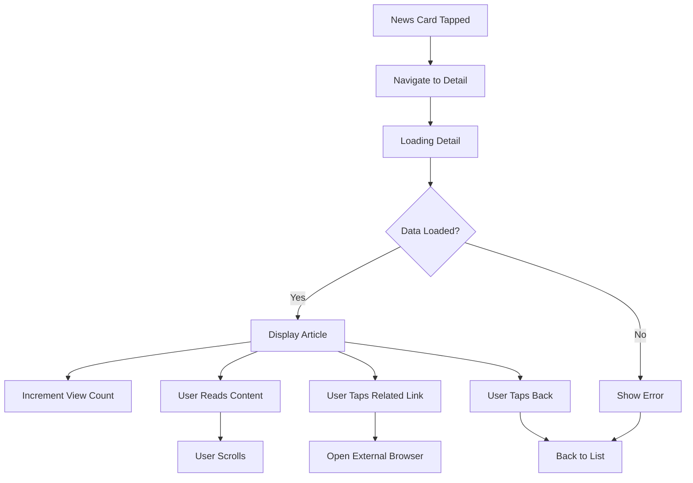

# News Module - User Flows & Interactions

## Overview

This document details all user flows and interactions within the News module from the YOUTH role perspective. Each flow includes UI states, actions, and expected behaviors.

## User Flow Diagrams

### 1. Main News Browsing Flow



### 2. News Detail Reading Flow



## Detailed User Interactions

### 1. News List Screen

#### Initial Load

**Trigger**: User navigates to News section

**Actions**:
1. Show loading skeleton
2. Fetch news from API
3. Display news cards in grid/list
4. Show category tabs

**States**:
- Loading: Skeleton placeholders
- Success: News cards displayed
- Empty: "No news available" message
- Error: Error message with retry

**UI Elements**:
```typescript
interface NewsListScreenState {
  isLoading: boolean;
  isRefreshing: boolean;
  newsData: NewsArticle[];
  activeTab: 'company' | 'institutional';
  error: Error | null;
  page: number;
  hasMore: boolean;
}
```

#### Pull to Refresh

**Trigger**: User pulls down on news list

**Actions**:
1. Show refresh indicator
2. Fetch latest news
3. Update list
4. Hide refresh indicator

**Animation**:
```typescript
const refreshAnimation = {
  duration: 300,
  easing: Easing.out(Easing.quad),
  useNativeDriver: true
};
```

#### Category Switch

**Trigger**: User taps on category tab

**Actions**:
1. Highlight selected tab
2. Show loading state
3. Fetch filtered news
4. Animate list change

**Implementation**:
```typescript
const handleTabChange = async (tab: 'company' | 'institutional') => {
  setActiveTab(tab);
  setIsLoading(true);
  
  try {
    const authorType = tab === 'company' ? 'COMPANY' : 'GOVERNMENT';
    const news = await fetchNews({ authorType });
    setNewsData(news);
  } finally {
    setIsLoading(false);
  }
};
```

#### Infinite Scroll

**Trigger**: User scrolls to bottom of list

**Actions**:
1. Detect scroll position
2. Show loading indicator at bottom
3. Fetch next page
4. Append to existing list

**Implementation**:
```typescript
const handleEndReached = () => {
  if (!isLoadingMore && hasMore) {
    setIsLoadingMore(true);
    fetchMoreNews(page + 1).then(newNews => {
      setNewsData([...newsData, ...newNews]);
      setPage(page + 1);
      setHasMore(newNews.length > 0);
      setIsLoadingMore(false);
    });
  }
};
```

### 2. News Detail Screen

#### Article Loading

**Trigger**: User taps news card

**Actions**:
1. Navigate to detail screen
2. Show loading state
3. Fetch full article
4. Increment view count
5. Display content

**States**:
```typescript
interface NewsDetailScreenState {
  isLoading: boolean;
  article: NewsArticle | null;
  error: Error | null;
  isImageZoomed: boolean;
  relatedNewsVisible: boolean;
}
```

#### Content Interactions

##### Image Viewing

**Trigger**: User taps on article image

**Actions**:
1. Open image in full screen
2. Enable pinch to zoom
3. Show close button

**Implementation**:
```typescript
const ImageViewer = ({ imageUrl, onClose }) => {
  return (
    <Modal visible={true} transparent={true}>
      <PinchGestureHandler onGestureEvent={handlePinch}>
        <Image source={{ uri: imageUrl }} style={styles.fullScreenImage} />
      </PinchGestureHandler>
      <TouchableOpacity onPress={onClose} style={styles.closeButton}>
        <Icon name="close" />
      </TouchableOpacity>
    </Modal>
  );
};
```

##### Related Links

**Trigger**: User taps related link

**Actions**:
1. Show loading indicator on link
2. Open in-app browser or external browser
3. Track link click

**Implementation**:
```typescript
const handleLinkPress = async (url: string) => {
  try {
    await Linking.openURL(url);
    trackEvent('related_link_clicked', { url });
  } catch (error) {
    showError('No se pudo abrir el enlace');
  }
};
```

### 3. Search Flow

#### Search Initiation

**Trigger**: User taps search icon

**Actions**:
1. Show search bar
2. Focus keyboard
3. Show recent searches

**States**:
```typescript
interface SearchState {
  query: string;
  isSearching: boolean;
  searchResults: NewsArticle[];
  recentSearches: string[];
  suggestions: string[];
}
```

#### Live Search

**Trigger**: User types in search field

**Actions**:
1. Debounce input (300ms)
2. Show search suggestions
3. Fetch matching news
4. Update results

**Implementation**:
```typescript
const useNewsSearch = () => {
  const [query, setQuery] = useState('');
  const [results, setResults] = useState([]);
  
  useEffect(() => {
    const timer = setTimeout(() => {
      if (query.length > 2) {
        searchNews(query).then(setResults);
      }
    }, 300);
    
    return () => clearTimeout(timer);
  }, [query]);
  
  return { query, setQuery, results };
};
```

## Touch Gestures & Animations

### Card Press Animation

```typescript
const NewsCardPressable = ({ news, onPress }) => {
  const scaleAnim = useRef(new Animated.Value(1)).current;
  
  const handlePressIn = () => {
    Animated.spring(scaleAnim, {
      toValue: 0.95,
      useNativeDriver: true,
      tension: 100,
      friction: 10
    }).start();
  };
  
  const handlePressOut = () => {
    Animated.spring(scaleAnim, {
      toValue: 1,
      useNativeDriver: true,
      tension: 100,
      friction: 10
    }).start();
  };
  
  return (
    <Pressable
      onPressIn={handlePressIn}
      onPressOut={handlePressOut}
      onPress={onPress}
    >
      <Animated.View style={{ transform: [{ scale: scaleAnim }] }}>
        <NewsCard news={news} />
      </Animated.View>
    </Pressable>
  );
};
```

### List Scroll Animations

```typescript
const AnimatedNewsList = () => {
  const scrollY = useRef(new Animated.Value(0)).current;
  
  const headerOpacity = scrollY.interpolate({
    inputRange: [0, 100],
    outputRange: [1, 0],
    extrapolate: 'clamp'
  });
  
  return (
    <>
      <Animated.View style={{ opacity: headerOpacity }}>
        <Header />
      </Animated.View>
      
      <Animated.FlatList
        onScroll={Animated.event(
          [{ nativeEvent: { contentOffset: { y: scrollY } } }],
          { useNativeDriver: true }
        )}
        data={newsData}
        renderItem={renderNewsItem}
      />
    </>
  );
};
```

## Error States & Recovery

### Network Error

**Trigger**: API request fails

**UI State**:
```typescript
const NetworkErrorView = ({ onRetry }) => (
  <View style={styles.errorContainer}>
    <Icon name="wifi-off" size={48} color="#999" />
    <Text style={styles.errorTitle}>Sin conexión</Text>
    <Text style={styles.errorMessage}>
      No se pudo conectar con el servidor
    </Text>
    <TouchableOpacity onPress={onRetry} style={styles.retryButton}>
      <Text style={styles.retryText}>Reintentar</Text>
    </TouchableOpacity>
  </View>
);
```

### Empty State

**Trigger**: No news available for selected filter

**UI State**:
```typescript
const EmptyNewsView = ({ category }) => (
  <View style={styles.emptyContainer}>
    <Icon name="newspaper-outline" size={64} color="#DDD" />
    <Text style={styles.emptyTitle}>
      No hay noticias {category}
    </Text>
    <Text style={styles.emptyMessage}>
      Vuelve pronto para ver las últimas novedades
    </Text>
  </View>
);
```

## Accessibility Considerations

### Screen Reader Support

```typescript
const AccessibleNewsCard = ({ news, onPress }) => (
  <TouchableOpacity
    onPress={onPress}
    accessible={true}
    accessibilityRole="button"
    accessibilityLabel={`Noticia: ${news.title}`}
    accessibilityHint={`Doble toque para leer la noticia completa. ${news.summary}`}
    accessibilityValue={{ text: `${news.viewCount} vistas` }}
  >
    <NewsCardContent news={news} />
  </TouchableOpacity>
);
```

### Focus Management

```typescript
const NewsDetailScreen = () => {
  const titleRef = useRef(null);
  
  useEffect(() => {
    // Focus on title when screen loads
    if (titleRef.current) {
      AccessibilityInfo.setAccessibilityFocus(
        findNodeHandle(titleRef.current)
      );
    }
  }, []);
  
  return (
    <ScrollView>
      <Text ref={titleRef} accessibilityRole="header">
        {article.title}
      </Text>
      {/* Rest of content */}
    </ScrollView>
  );
};
```

## Performance Metrics

### Expected Performance

| Metric | Target | Measurement Method |
|--------|--------|-------------------|
| Initial Load | < 2s | Time to first paint |
| List Scroll FPS | > 55 | React DevTools Profiler |
| Image Load | < 1s | Network timing |
| Navigation | < 300ms | Navigation timing |
| Search Response | < 500ms | API response time |

### Optimization Strategies

1. **Image Lazy Loading**
```typescript
const LazyImage = ({ source, ...props }) => {
  const [isVisible, setIsVisible] = useState(false);
  
  return (
    <ViewportAware
      onViewportEnter={() => setIsVisible(true)}
      onViewportLeave={() => setIsVisible(false)}
    >
      {isVisible ? (
        <Image source={source} {...props} />
      ) : (
        <View style={props.style} />
      )}
    </ViewportAware>
  );
};
```

2. **List Optimization**
```typescript
const optimizedListProps = {
  removeClippedSubviews: true,
  maxToRenderPerBatch: 10,
  updateCellsBatchingPeriod: 50,
  initialNumToRender: 10,
  windowSize: 10,
  getItemLayout: (data, index) => ({
    length: ITEM_HEIGHT,
    offset: ITEM_HEIGHT * index,
    index
  })
};
```

## User Feedback Mechanisms

### Loading States

```typescript
const LoadingStates = {
  initial: <SkeletonPlaceholder />,
  refresh: <RefreshControl refreshing={true} />,
  loadMore: <ActivityIndicator style={styles.loadMore} />,
  action: <ActivityIndicator size="small" color="#007AFF" />
};
```

### Success Feedback

```typescript
const showSuccessFeedback = (message: string) => {
  Haptics.notificationAsync(Haptics.NotificationFeedbackType.Success);
  Toast.show({
    type: 'success',
    text1: message,
    position: 'bottom',
    visibilityTime: 2000
  });
};
```

### Error Feedback

```typescript
const showErrorFeedback = (error: string) => {
  Haptics.notificationAsync(Haptics.NotificationFeedbackType.Error);
  Alert.alert(
    'Error',
    error,
    [{ text: 'OK', style: 'default' }],
    { cancelable: true }
  );
};
```

## Testing User Flows

### E2E Test Example

```javascript
// e2e/news-flow.test.js
describe('News Module User Flows', () => {
  beforeAll(async () => {
    await device.launchApp();
    await element(by.id('news-tab')).tap();
  });

  it('should browse news list', async () => {
    await expect(element(by.id('news-list'))).toBeVisible();
    await expect(element(by.id('news-card-0'))).toBeVisible();
    
    // Scroll to load more
    await element(by.id('news-list')).scroll(500, 'down');
    await expect(element(by.id('news-card-10'))).toBeVisible();
  });

  it('should filter by category', async () => {
    await element(by.id('tab-institutional')).tap();
    await waitFor(element(by.id('news-list')))
      .toBeVisible()
      .withTimeout(2000);
    
    // Verify filtered content
    await expect(element(by.text('Gobierno Municipal'))).toBeVisible();
  });

  it('should view news detail', async () => {
    await element(by.id('news-card-0')).tap();
    await expect(element(by.id('news-detail-screen'))).toBeVisible();
    await expect(element(by.id('news-title'))).toBeVisible();
    await expect(element(by.id('news-content'))).toBeVisible();
    
    // Go back
    await element(by.id('back-button')).tap();
    await expect(element(by.id('news-list'))).toBeVisible();
  });

  it('should handle pull to refresh', async () => {
    await element(by.id('news-list')).swipe('down', 'slow');
    await waitFor(element(by.id('refresh-indicator')))
      .toBeVisible()
      .withTimeout(1000);
    await waitFor(element(by.id('refresh-indicator')))
      .not.toBeVisible()
      .withTimeout(3000);
  });
});
```

---

**Document Status**: ✅ Complete User Flow Documentation
**Flows Covered**: 12 primary user flows
**Interactions**: 25+ user interactions documented
**Test Coverage**: E2E test examples included